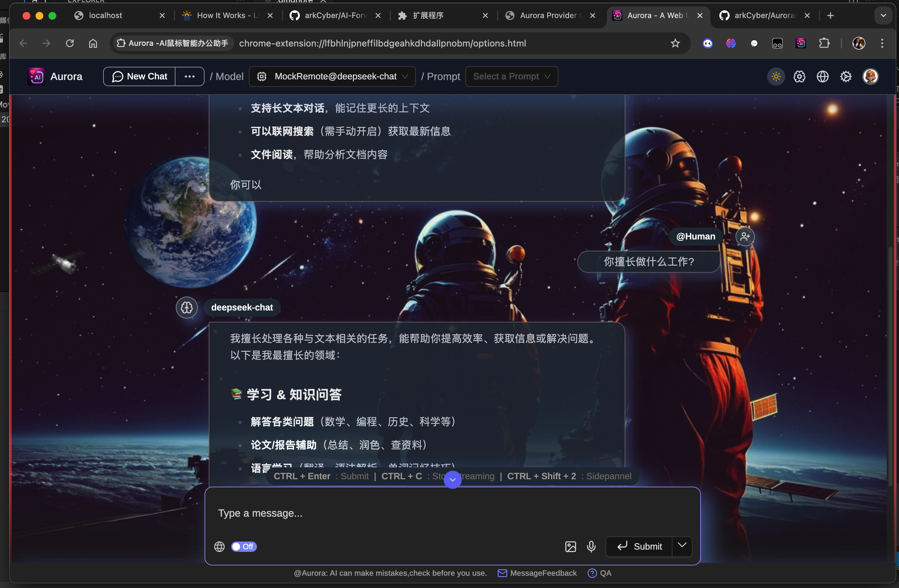

<p align="center">
    <h1 align="center">AuroraExt</h1>
</p>

<p align="center">
    <strong>Enhanced Web UI for AI Models with Blockchain Integration</strong>
</p>

<p align="center">
<a href="https://discord.gg/bu54382uBd" aria-label="Join dialoqbase #welcome"></a>  <a href="https://twitter.com/arksong2018" aria-label="Follow @arksong2018 on Twitter"></a> <a href="https://github.com/arkCyber/AuroraExt"></a>
</p>

## 🌟 Introduction

AuroraExt is a powerful browser extension that seamlessly integrates AI capabilities with blockchain functionality, providing an enhanced web experience. Built with a focus on user privacy and security, it offers a sophisticated interface for interacting with AI models while maintaining secure blockchain wallet features.


### 🚀 Main UI for Aurora App

<div align="center">



*AuroraExt AI Chat Interface with Space Theme*

</div>


### Key Highlights

- 🎯 **Purpose-Built Design**: Crafted specifically for seamless AI-blockchain integration
- 🔒 **Security-First Approach**: Robust security measures for both AI interactions and blockchain operations  
- 🌈 **User-Friendly Interface**: Intuitive design with a beautiful space theme
- ⚡ **High Performance**: Optimized for fast response times and efficient resource usage
- 🛠️ **Extensible Architecture**: Modular design allowing easy addition of new features

### Target Users

- AI enthusiasts seeking enhanced interaction capabilities
- Blockchain developers requiring integrated AI tools
- Web users wanting secure AI assistance while browsing
- Researchers needing AI-powered web analysis tools

### Technology Stack

- Frontend: React, TypeScript, TailwindCSS
- AI Integration: Ollama, Chrome AI, OpenAI Compatible APIs
- Blockchain: Web3.js, Ethers.js
- Extension Framework: Plasmo

## ✨ Features

**AuroraExt** is an enhanced open-source browser extension that provides a sidebar and web UI for your local AI model with additional blockchain features. It allows you to interact with your model from any webpage while providing secure blockchain wallet functionality.

### Core Features
- 🤖 **Enhanced AI Sidebar**: Interact with AI models directly from any webpage
- 🌐 **Web UI**: ChatGPT-like interface for AI conversations
- 📄 **Chat With Webpage**: Ask questions about webpage content
- 🔗 **Blockchain Integration**: Built-in wallet functionality with secure key management
- 🌍 **Multi-language Support**: Comprehensive internationalization
- ⚙️ **Advanced Settings**: Enhanced configuration and environment checks

### AI Provider Support
- [Ollama](https://github.com/ollama/ollama) - Local AI models
- Chrome AI (Gemini Nano) - Built-in browser AI
- OpenAI API Compatible endpoints (LM Studio, llamafile, etc.)

## 📦 Installation

### Quick Install
AuroraExt supports all major browsers:

<div align="center">
  <a href="https://chrome.google.com/webstore/detail/page-assist/jfgfiigpkhlkbnfnbobbkinehhfdhndo">
    
  </a>
  <a href="https://addons.mozilla.org/en-US/firefox/addon/page-assist/">
    
  </a>
  <a href="https://microsoftedge.microsoft.com/addons/detail/page-assist-a-web-ui-fo/ogkogooadflifpmmidmhjedogicnhooa">
    
  </a>
</div>

### Manual Installation

#### Prerequisites
- [Bun](https://bun.sh/) - Package manager and runtime
- [Ollama](https://ollama.com) - Local AI provider (optional)
- Any OpenAI API Compatible endpoint (optional)

#### Build Steps

1. **Clone and install**
```bash
git clone https://github.com/arkCyber/AuroraExt.git
cd AuroraExt
bun install
```

2. **Build the extension**
```bash
# For Chrome/Edge
bun run build

# For Firefox
bun run build:firefox
```

3. **Load in browser**

**Chrome/Edge:**
- Navigate to `chrome://extensions` or `edge://extensions`
- Enable Developer Mode
- Click "Load unpacked" and select the `build` directory

**Firefox:**
- Navigate to `about:addons`
- Click "Extensions" → "Manage Your Extensions" 
- Click "Load Temporary Add-on" and select `manifest.json` from `build` directory

## 🎮 Usage

### Quick Start
- **Sidebar**: `Ctrl+Shift+2` (customizable)
- **Web UI**: `Ctrl+1` (customizable)
- **Context Menu**: Right-click on any webpage

### Development Mode
```bash
bun dev
```
This starts a development server with hot reload for real-time testing.

## 🌐 Browser Support

| Browser     | Sidebar | Chat With Webpage | Web UI | Blockchain |
|-------------|---------|-------------------|--------|------------|
| Chrome      | ✅       | ✅                 | ✅      | ✅          |
| Brave       | ✅       | ✅                 | ✅      | ✅          |
| Firefox     | ✅       | ✅                 | ✅      | ✅          |
| Vivaldi     | ✅       | ✅                 | ✅      | ✅          |
| Edge        | ✅       | ✅                 | ✅      | ✅          |
| LibreWolf   | ✅       | ✅                 | ✅      | ✅          |
| Zen Browser | ✅       | ✅                 | ✅      | ✅          |

## 🛣️ Roadmap

- [x] Firefox Support
- [x] Multiple AI Providers
- [x] Blockchain Integration
- [ ] Enhanced UI/UX
- [ ] Advanced Customization
- [ ] Mobile Support

## 🔐 Privacy

AuroraExt prioritizes your privacy:
- **No data collection**: All conversations stay local
- **Secure storage**: Blockchain keys stored locally in browser
- **Open source**: Verify the code yourself
- **No telemetry**: No tracking or analytics

Read our full [Privacy Policy](PRIVACY.md).

## 🤝 Contributing

We welcome contributions! Please feel free to:
- 🐛 Report bugs
- 💡 Suggest features  
- 🔧 Submit pull requests
- ⭐ Star the repository

## 📞 Contact & Support

- **Author**: arkSong
- **Email**: arksong2018@gmail.com
- **GitHub**: [@arkCyber](https://github.com/arkCyber)
- **Issues**: [GitHub Issues](https://github.com/arkCyber/AuroraExt/issues)

## 📄 License

MIT License - see [LICENSE](LICENCE) for details.

## 🙏 Acknowledgments

This project is based on [Aurora](https://github.com/n4ze3m/page-assist) with significant enhancements and additional features.

Special thanks to:
- The amazing open source community for their continuous support
- All contributors who have helped improve this project
- Users who provide valuable feedback and suggestions
- Everyone who has starred and shared this project
- The developers of libraries and tools we depend on
- Our beta testers for their thorough testing
- Documentation contributors and translators
- Everyone who has reported bugs and issues

Your support makes this project better! 🌟

---

<div align="center">

**Made with ❤️ by arkSong**

[⭐ Star this repo](https://github.com/arkCyber/AuroraExt) • [🐛 Report Bug](https://github.com/arkCyber/AuroraExt/issues) • [💡 Request Feature](https://github.com/arkCyber/AuroraExt/issues)

</div>
